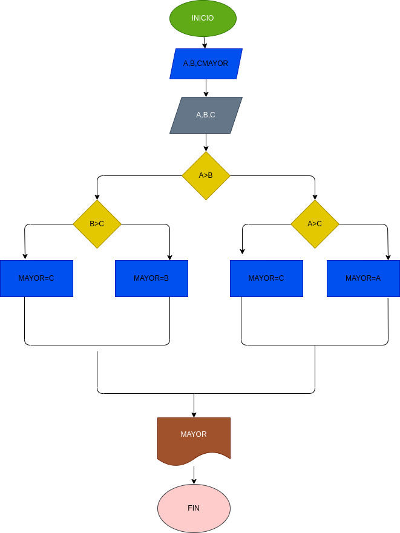

# EJERCICIO 1 ESTRUCTURAS CONDICINALES

## Programa para verificar si usted es mayor de edad.

## ANALISIS

a: primer numero
b: segundo numero
c: tercer numero
mayor: numero mayor

se comparanlos tres valores entre si para hallar el mas grande.

## DISEÑO

